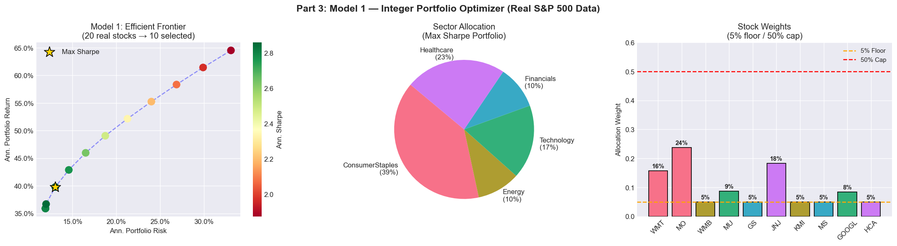
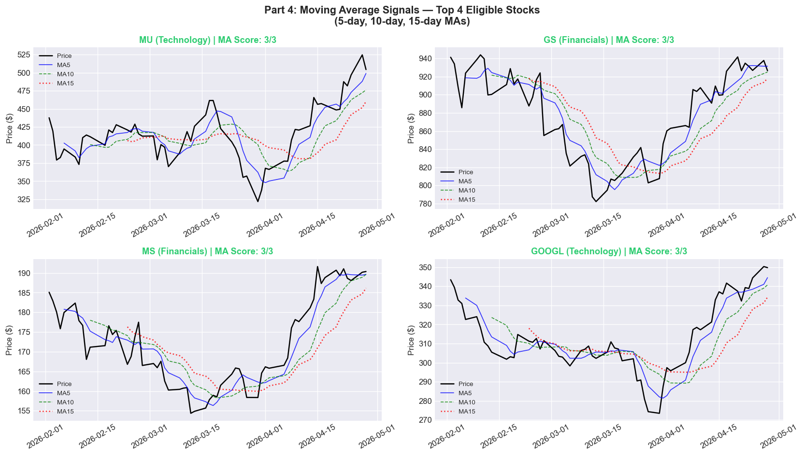
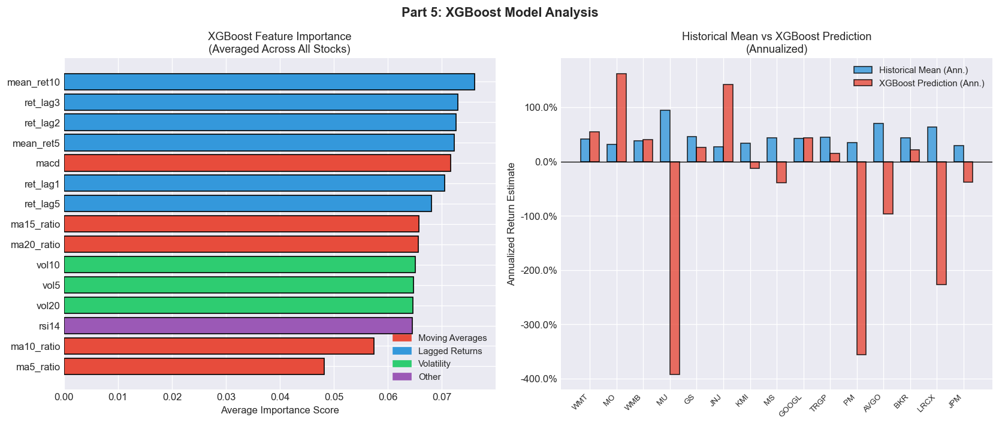
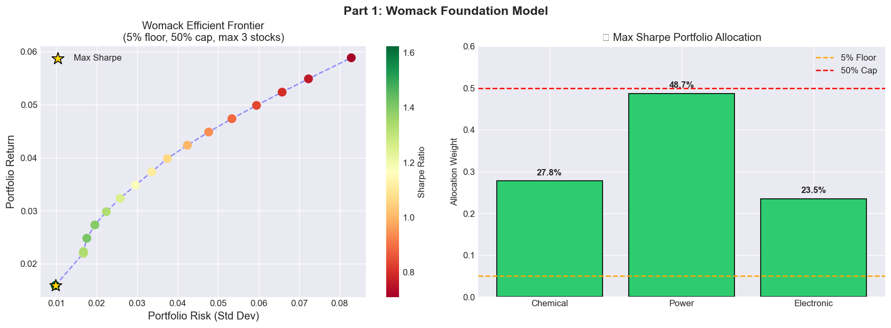

# Active Portfolio Optimization with Integer Constraints

This project builds and evaluates a daily-rebalanced portfolio optimizer using Modern Portfolio Theory, integer selection variables, sector constraints, moving-average signals, and an XGBoost return-prediction overlay.

The model is designed to answer a practical trading question:

> Given a real stock universe, which 10 stocks should be held today, how much capital should go into each one, and how does that active portfolio compare with buying and holding the S&P 500?

## Current Forward-Test Snapshot

Latest generated date: **2026-04-28**

| Metric | Value |
|---|---:|
| Starting wealth | $100,000 |
| Latest portfolio value | $103,234.14 |
| Wealth gain | $3,234.14 |
| Cumulative return | 3.39% |
| Holdings | 10 stocks |
| Sector rule | 2 stocks from each of 5 sectors |
| Weight bounds | 5% minimum, 50% maximum per selected stock |

## Portfolio Dashboard


## Latest Holdings

The latest daily holdings are stored in [`data/latest_portfolio_holdings.csv`](data/latest_portfolio_holdings.csv).

| Stock | Sector | Weight |
|---|---|---:|
| MO | ConsumerStaples | 29.94% |
| TRGP | Energy | 25.13% |
| AVGO | Technology | 8.97% |
| MS | Financials | 5.96% |
| WMT | ConsumerStaples | 5.00% |
| MU | Technology | 5.00% |
| JNJ | Healthcare | 5.00% |
| BKR | Energy | 5.00% |
| JPM | Financials | 5.00% |
| AMGN | Healthcare | 5.00% |

## Key Visuals to Review

### 1. Final Performance Dashboard

Shows portfolio NAV, rolling Sharpe, drawdown, and allocation heatmap. This should be the first image in the README because it communicates model performance and risk behavior quickly.


### 2. Integer MPT Optimizer Results

Shows the efficient frontier, sector allocation, and stock-level weights for the constrained optimizer.



### 3. Moving-Average Signal Dashboard

Shows the technical signal screen used to filter or evaluate stocks before optimization.



### 4. XGBoost Feature and Prediction Analysis

Shows which engineered features mattered most and compares model-predicted returns against historical means.



### 5. Womack Foundation Model

Included as the classroom foundation for the integer/nonlinear optimization idea.



## Model Design

The main optimizer uses:

- Continuous allocation variables `X[k]`
- Binary selection variables `Y[k]`
- Budget constraint: all weights sum to 1
- Linking constraints: selected stocks must receive between 5% and 50%
- Cardinality constraint: exactly 10 selected stocks
- Sector constraint: exactly 2 stocks from each of 5 sectors
- Efficient-frontier sweep: automatically selects the maximum Sharpe point
- Daily forward test starting on 2026-04-21

## Repository Contents

```text
.
+-- data/
|   +-- latest_portfolio_holdings.csv
|   +-- portfolio_daily_summary.csv
|   +-- portfolio_forward_log.csv
+-- docs/
|   +-- GITHUB_POSTING_CHECKLIST.md
|   +-- MODEL_CARD.md
+-- reports/
|   +-- final_dashboard.png
|   +-- latest_summary.md
|   +-- ma_signals.png
|   +-- model1_results.png
|   +-- womack_frontier.png
|   +-- xgboost_analysis.png
+-- notebooks/
|   +-- BDM_final_portfolio_notebook.ipynb
|   +-- README.md
+-- scripts/
|   +-- collect_outputs.py
|   +-- render_latest_summary.py
|   +-- validate_outputs.py
+-- .github/workflows/daily_portfolio_refresh.yml
+-- requirements.txt
+-- README.md
```

## Daily Automation

This repository is designed to refresh automatically with GitHub Actions:

- Schedule: Monday-Friday at **3:45 PM Eastern during daylight saving time**
- GitHub cron: `45 19 * * 1-5`
- Manual run: GitHub repo -> **Actions** -> **Daily Portfolio Refresh** -> **Run workflow**

The workflow executes the notebook, refreshes Yahoo Finance data, regenerates dashboards/CSVs, validates the hard constraints, and commits updated outputs back to the repository.

Important timing note: GitHub Actions cron uses UTC. `19:45 UTC` equals `3:45 PM ET` during daylight saving time. After daylight saving time ends, change the cron to `45 20 * * 1-5` if you still want exactly 3:45 PM Eastern.

## How to Refresh Results Locally

In Colab, run from **Part 2: Real S&P 500 Data Pipeline** onward. That refreshes Yahoo Finance prices, reruns the models, updates the forward test, and regenerates the output CSVs and dashboard images.

## Next Professional Additions

The strongest next upgrades for a technical GitHub audience are:

- Convert the notebook into a reproducible Python pipeline under `src/`
- Add a GitHub Actions workflow that refreshes results daily after market close
- Publish a lightweight Streamlit dashboard or GitHub Pages report
- Add transaction cost/slippage assumptions
- Add risk limits such as max drawdown, volatility ceiling, and turnover cap
- Add unit tests for constraints and allocation validation
- Add a model card and data card explaining assumptions, limitations, and data sources

## Disclaimer

This project is for educational and modeling purposes only. It is not financial advice, and past performance does not guarantee future results.
