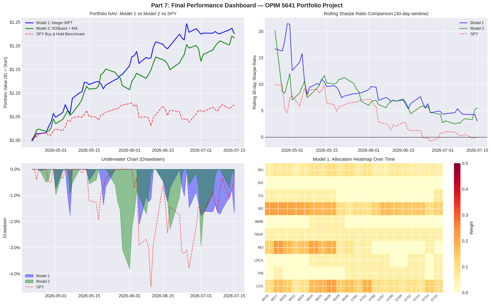

# Latest Portfolio Summary

Latest refresh date: **2026-07-15**

| Metric | Value |
|---|---:|
| Portfolio value | $122,561.60 |
| Wealth gain | $22,561.60 |
| Cumulative return | 22.84% |
| Average daily return | 0.35% |
| Holdings | 10 |
| Sector rule | 2 stocks from each of 5 sectors |
| Weight bounds | 5% minimum, 50% maximum |

## Latest Holdings

| Stock | Sector | Weight | Holding Value |
| --- | --- | --- | --- |
| KO | ConsumerStaples | 32.21% | $39,473.71 |
| MS | Financials | 13.81% | $16,919.70 |
| CVS | Healthcare | 10.83% | $13,269.20 |
| VLO | Energy | 10.63% | $13,032.15 |
| GS | Financials | 7.53% | $9,226.44 |
| MU | Technology | 5.00% | $6,128.08 |
| TRGP | Energy | 5.00% | $6,128.08 |
| LRCX | Technology | 5.00% | $6,128.08 |
| PM | ConsumerStaples | 5.00% | $6,128.08 |
| ABBV | Healthcare | 5.00% | $6,128.08 |

## Dashboard

