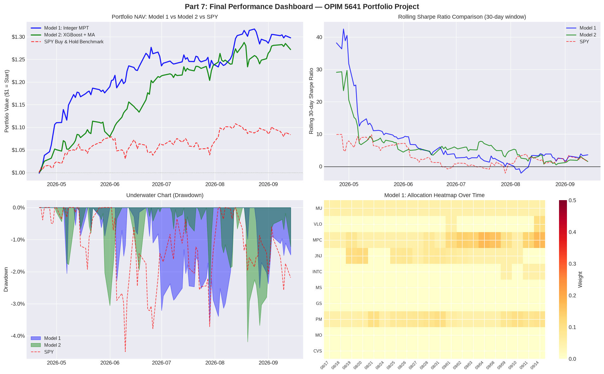

# Latest Portfolio Summary

Latest refresh date: **2026-08-13**

| Metric | Value |
|---|---:|
| Portfolio value | $132,543.50 |
| Wealth gain | $32,543.50 |
| Cumulative return | 32.65% |
| Average daily return | 0.36% |
| Holdings | 10 |
| Sector rule | 2 stocks from each of 5 sectors |
| Weight bounds | 5% minimum, 50% maximum |

## Latest Holdings

| Stock | Sector | Weight | Holding Value |
| --- | --- | --- | --- |
| JPM | Financials | 23.37% | $30,975.89 |
| KO | ConsumerStaples | 19.15% | $25,387.83 |
| TRV | Financials | 17.69% | $23,449.46 |
| MPC | Energy | 9.78% | $12,967.26 |
| MU | Technology | 5.00% | $6,627.17 |
| LRCX | Technology | 5.00% | $6,627.17 |
| JNJ | Healthcare | 5.00% | $6,627.17 |
| VLO | Energy | 5.00% | $6,627.17 |
| PM | ConsumerStaples | 5.00% | $6,627.17 |
| ABBV | Healthcare | 5.00% | $6,627.17 |

## Dashboard

