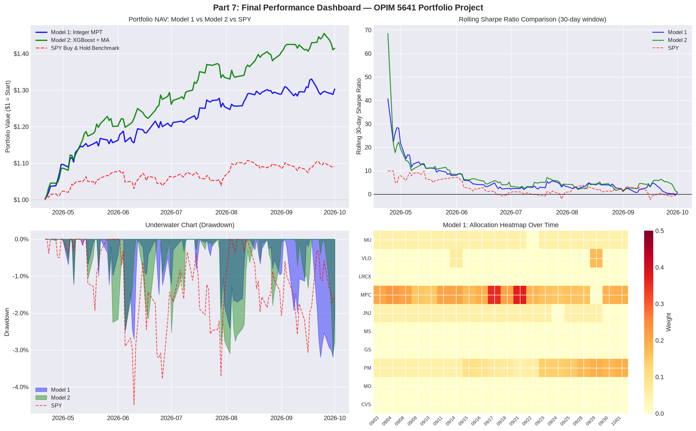

# Latest Portfolio Summary

Latest refresh date: **2026-10-07**

| Metric | Value |
|---|---:|
| Portfolio value | $142,763.38 |
| Wealth gain | $42,763.38 |
| Cumulative return | 42.51% |
| Average daily return | 0.31% |
| Holdings | 10 |
| Sector rule | 2 stocks from each of 5 sectors |
| Weight bounds | 5% minimum, 50% maximum |

## Latest Holdings

| Stock | Sector | Weight | Holding Value |
| --- | --- | --- | --- |
| PM | ConsumerStaples | 26.29% | $37,530.94 |
| MPC | Energy | 20.59% | $29,398.62 |
| PSX | Energy | 11.68% | $16,680.06 |
| MRK | Healthcare | 10.17% | $14,517.78 |
| ABBV | Healthcare | 6.01% | $8,580.65 |
| KO | ConsumerStaples | 5.22% | $7,454.96 |
| INTC | Technology | 5.03% | $7,185.85 |
| MU | Technology | 5.00% | $7,138.17 |
| TRV | Financials | 5.00% | $7,138.17 |
| JPM | Financials | 5.00% | $7,138.17 |

## Dashboard

